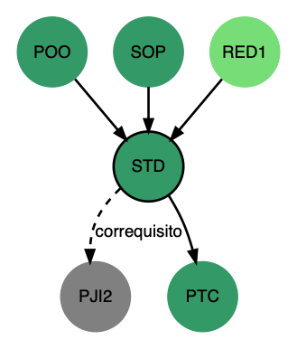

# Grade da Engenharia de Telecomunicações

Esse repositório contém um conjunto de *scripts* para auxiliar montar um grafo com a grade de disciplinas. Se desejar, veja mais sobre [DOT Language aqui](https://www.graphviz.org/documentation/). Se desejar, veja mais sobre a [*graph pattern scanning and processing language* (gvpr) aqui](https://www.mankier.com/1/gvpr).

## Ferramentas necessárias

- [Graphviz](https://www.graphviz.org/) - visualizador de grafos
  ```shell
  sudo apt install graphviz
  ```
- [Visual Studio Code](https://code.visualstudio.com/) - editor de texto
  - Instale as seguintes extensões
    - [Graphviz (dot) language support for Visual Studio Code](https://marketplace.visualstudio.com/items?itemName=Stephanvs.dot)
    - [Graphviz Preview](https://marketplace.visualstudio.com/items?itemName=EFanZh.graphviz-preview)
    - [Graphviz Interactive Preview](https://marketplace.visualstudio.com/items?itemName=tintinweb.graphviz-interactive-preview) (opcional)
- [Pandoc](https://pandoc.org/) (opcional)
  
    - Somente se for gerar o .dot a partir dos arquivos .DOCX

## Gerando arquivo `.dot` a partir dos arquivos `.docx`

> É necessário ter o aplicativo [pandoc](https://pandoc.org/) instalado. 

Cada disciplina deve ter um arquivo `.docx` e estes arquivos estão organizados nos seguintes subdiretórios:

```
ementas
|-- eixo-amarelo
|-- eixo-azul
|-- eixo-cinza
|-- eixo-laranja
|-- eixo-marrom
|-- eixo-roxo
|-- eixo-verde-claro
`-- eixo-verde-escuro
```

> Nesse repositório tem um diretório [ementas](ementas) com um exemplo de como deve ser o documento para cada disciplina.
>
> É possível baixar o diretório `ementas` como um arquivo `.zip` a partir da pasta compartilhada no Google Drive (para quem tem acesso).   

Para gerar o arquivo `.dot` a partir dos arquivos contidos no subdiretório `ementas`, digite:

```bash
bash gera-cadeia-requisitos.sh ementas saida.dot 
```

## Gerando imagens `.svg`

O *shell script* [gera-svg.sh](gera-svg.sh) gera uma imagem `.svg` e, se as disciplinas já estiveram alocadas dentro das fases, também fará a contabilização da carga horária total dentro de cada fase, além de incluir o número de créditos de cada disciplina no rótulo de cada nó do grafo. 

Para executar o *shell script* [gera-svg.sh](gera-svg.sh)  é necessário informar o arquivo `.dot` e nome do arquivo `.svg` que será gerado. Exemplo:

- O arquivo [ppc2015.dot](ppc2015.dot) contém o fonte da grade da Engenharia de Telecomunicações do PPC de 2015. 

- Use o *shell script* [gera-svg.sh](gera-svg.sh) para gerar uma imagem SVG do grafo.
  ```shell
  bash gera-svg.sh ppc2015.dot pagina-html/grade.svg
  ```

Isso vai criar um arquivo `grade.svg` no subdiretório `pagina-html`.

### Servidor web local para carregar SVG com destaque em JavaScript

Para permitir destacar somente as arestas de um determinado nó (ao clicar sobre o mesmo), é necessário exportar o grafo para `.svg` e usar um servidor web para ofertar os arquivos contidos no diretório `pagina-html`.  No computador pessoal é possível usar o servidor web que vem junto com o python3.

```bash
cd pagina-html
python3 -m http.server
```

Feito isso, aponte o navegador para a URL: http://localhost:8000/?grafo=grade. 

É possível ter mais de uma imagem `.svg` no diretório `pagina-html`. Para carregar diferentes `.svg`, basta informar o nome do arquivo, sem a extensão, para a variável `grafo`. 

Por exemplo, no diretório `pagina-html` tem dois arquivos `.svg`: `grade.svg` e `novo.svg`. Sendo assim, para carregar o arquivo `novo.svg` basta informar a seguinte URL: http://localhost:8000/?grafo=novo.

Se não for informado nenhum valor para a variável `grafo`, então será carregado por padrão o arquivo `grade.svg`.

## Gerando um arquivo PNG por disciplina com suas sucessoras e predecessoras

Para gerar um arquivo png para cada disciplina basta informar o nome do arquivo `.dot` (gerado pelo script [gera-cadeia-requisitos.sh](gera-cadeia-requisitos.sh)) e no nome do subdiretório onde as imagens PNG deverão ser criadas. Exemplo:

```bash
bash gera-sucessores-predecessores.sh saida.dot pngs
```

Abaixo é apresentado um exemplo da saída gerada para a disciplina Sistemas Distribuídos (STD). Os arcos que representam correquisitos estão com estilo tracejado e com o rótulo *correquisito*. A disciplina STD está com uma borda preta para indicar que o grafo foi montado a partir dela. Ou seja, para listar as disciplinas sucessoras e predecessoras de STD. 


